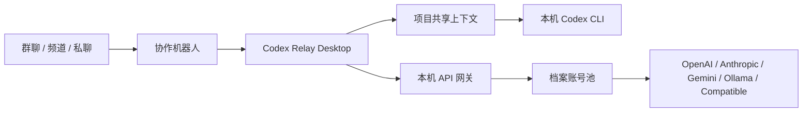

<p align="center">
  
</p>

<h1 align="center">Codex Relay</h1>

<p align="center">
  本机优先的 Codex 档案、API 网关与群聊协作入口。
</p>

<p align="center">
  <a href="https://github.com/RayZh0ng/codex-reply/actions/workflows/ci.yml"></a>
  <a href="https://github.com/RayZh0ng/codex-reply/actions/workflows/release.yml"></a>
  <a href="LICENSE"></a>
  
  
</p>

> 当前版本：`v1.0.0`。项目处于 MVP beta 阶段，功能边界以 [docs/PRD.md](docs/PRD.md) 为准。

## 目录

- [Codex Relay 是什么](#codex-relay-是什么)
- [核心能力](#核心能力)
- [工作流](#工作流)
- [快速开始](#快速开始)
- [macOS 未签名版本安装](#macos-未签名版本安装)
- [协作机器人](#协作机器人)
- [API 网关](#api-网关)
- [本地数据与密钥安全](#本地数据与密钥安全)
- [项目结构](#项目结构)
- [开发检查](#开发检查)
- [发布 beta](#发布-beta)
- [贡献](#贡献)

## Codex Relay 是什么

Codex Relay 是一个本机优先的 Tauri 2 桌面应用，用来在一台电脑上：

1. 管理多个 Codex / OpenAI-compatible 档案与凭据。
2. 将可用档案组成本机 OpenAI 兼容 API 网关。
3. 把飞书、QQ、企业微信、Discord、Telegram 中的协作请求转成 Codex CLI 任务。
4. 为同一个项目维护稳定 `CODEX_HOME`、active session、memory、goal、model 与 permissions 快照。

它适合个人开发者和小团队在本机保留凭据、任务上下文和协作控制权，同时把 Codex 能力接入常用沟通工具。

## 核心能力

| 能力                          | 说明                                                                                                                                      |
| ----------------------------- | ----------------------------------------------------------------------------------------------------------------------------------------- |
| Codex 档案管理                | 管理 OAuth、PAT、Agent Identity 与 OpenAI-compatible/API 服务档案，支持启停、切换、健康状态、额度与模型缓存。                             |
| 多格式 JSON 导入              | 支持 Codex `auth.json`、明确 token/session JSON、`accessToken`、`refresh_token`、PAT 与 Sub2API OpenAI OAuth 凭据的脱敏预览和批量导入。   |
| 本机 API 网关                 | 提供 Responses、Chat Completions、Anthropic Messages、Gemini、Ollama 兼容入口，支持账号池、模型映射、冷却、Client Key 和 CIDR allowlist。 |
| 群聊协作机器人                | 飞书、QQ、企业微信、Discord、Telegram 统一 `/codex` 命令，把群聊请求转发到本机 Codex 项目。                                               |
| 项目共享上下文                | 同一工作目录 + 执行方式 + 档案/模型复用稳定 `CODEX_HOME`、active Codex session、长期记忆和目标状态。                                      |
| 桌面更新                      | Tauri updater 支持 stable/beta 通道，GitHub Release 发布 updater manifest。                                                               |
| 本机加密凭据与最小化 IPC 输出 | OAuth、API Key、Client Key、机器人 Secret 存入本机加密 vault；SQLite 与 IPC 只返回脱敏信息或 secret reference。                           |

## 工作流



典型使用顺序：

1. 在“档案”页导入或创建 Codex / API 档案。
2. 在“网关”页把档案加入账号池，按需开启本机 API 服务。
3. 在“协作”页创建平台机器人，并绑定本机项目目录、执行方式和档案/模型。
4. 在群聊中发送 `/codex bind <绑定码>` 完成绑定。
5. 之后在群里 @ 机器人或使用 `/codex` 命令创建、继续、取消和查看 Codex 任务。

## 快速开始

### 环境要求

| 依赖  | 版本                                 |
| ----- | ------------------------------------ |
| Node  | `>=24.0.0 <25`                       |
| pnpm  | `>=10.14.0 <11`                      |
| Rust  | stable，需包含 `rustfmt` 与 `clippy` |
| macOS | 需要 Xcode Command Line Tools        |
| Linux | 需要 WebKitGTK 4.1 等 Tauri 构建依赖 |

### 从源码运行

```bash
corepack enable
pnpm install
pnpm tauri:dev
```

### 常用脚本

| 命令                 | 用途                                       |
| -------------------- | ------------------------------------------ |
| `pnpm dev`           | 启动 Vite 前端开发服务器                   |
| `pnpm tauri:dev`     | 启动完整桌面应用                           |
| `pnpm build`         | 类型检查并构建前端资源                     |
| `pnpm tauri:build`   | 生成当前平台 Tauri debug 安装包            |
| `pnpm tauri:package` | 生成日常发布安装包                         |
| `pnpm check`         | 运行格式、lint、类型、前端测试与 Rust 检查 |

## macOS 未签名版本安装

当前 beta 构建可能未经过 Apple Developer ID 签名和公证，macOS 下载后可能提示“已损坏，无法打开”或只允许“App Store 与已知开发者”。可使用以下任一方式安装。

### 方式一：仅放行 Codex Relay

先把 `Codex Relay.app` 拖到“应用程序”，再执行：

```bash
sudo xattr -dr com.apple.quarantine "/Applications/Codex Relay.app"
sudo codesign --force --deep --sign - "/Applications/Codex Relay.app"
open "/Applications/Codex Relay.app"
```

如果仍在“下载”目录运行，把路径改为：

```bash
sudo xattr -dr com.apple.quarantine "$HOME/Downloads/Codex Relay.app"
sudo codesign --force --deep --sign - "$HOME/Downloads/Codex Relay.app"
open "$HOME/Downloads/Codex Relay.app"
```

### 方式二：临时显示“任何来源”

启用系统设置中的“任何来源”选项：

```bash
sudo spctl --master-disable
```

然后打开“系统设置 → 隐私与安全性 → 安全性 → 允许以下来源的应用程序”，选择“任何来源”。安装完成后建议恢复默认设置：

```bash
sudo spctl --master-enable
```

可用以下命令检查当前状态：

```bash
spctl --status
```

显示 `assessments disabled` 表示已允许任何来源；显示 `assessments enabled` 表示已恢复默认校验。

## 协作机器人

在“协作”页创建机器人，再创建项目绑定：项目名、群命令 slug、本机工作目录、执行方式（档案直连或 API 网关）、档案/模型。保存后在目标群、频道或私聊发送：

```text
/codex bind <绑定码>
```

绑定完成后，首次 @ 机器人会创建新的项目共享上下文；之后自然对话会续接同一 Codex context，除非显式创建新会话。

### 支持平台

| 平台     | 接收方式                        | 回传方式                          |
| -------- | ------------------------------- | --------------------------------- |
| 飞书     | 自建应用机器人长连接事件        | 消息与卡片 API                    |
| QQ       | 官方机器人 WebSocket Gateway    | QQ OpenAPI 状态文本               |
| 企业微信 | 自建应用回调 URL                | 应用消息 API                      |
| Discord  | Discord Gateway / slash command | Interaction 与消息回传            |
| Telegram | Bot API `getUpdates` 长轮询     | `sendMessage` / `editMessageText` |

### 命令速查

| 命令                                                | 行为                                                                     |
| --------------------------------------------------- | ------------------------------------------------------------------------ |
| `@机器人 <自然语言>`                                | 首次创建项目共享上下文，后续续接 active Codex session                    |
| `/codex new [project] <task>` / `新会话` / `新任务` | 创建并切换新的 Codex 会话                                                |
| `/codex plan <task>`                                | 以 Relay 计划模式提示词执行一个 turn                                     |
| `/codex goal <objective>`                           | 设置长期目标并注入后续 turn                                              |
| `/codex goal edit <objective>`                      | 修改长期目标                                                             |
| `/codex goal pause` / `resume` / `clear`            | 暂停、恢复或清空长期目标                                                 |
| `/codex memories on` / `off` / `status`             | 更新或查看 context memory 配置                                           |
| `/codex model [model]`                              | 查看或切换上下文默认模型                                                 |
| `/codex permissions [policy]`                       | 查看或切换权限策略：`read-only`、`workspace-write`、`danger-full-access` |
| `/codex status [session_id]`                        | 查看 context 状态或指定会话状态                                          |
| `/codex resume <session_id>`                        | 切换 active Codex session                                                |
| `/codex compact`                                    | 压缩当前上下文供后续续接                                                 |
| `/codex review`                                     | 审查当前项目改动                                                         |
| `/codex sessions [project]`                         | 查看最近 Relay 会话                                                      |
| `/codex cancel <session_id>`                        | 取消运行中的 turn                                                        |
| `/codex continue <session_id> <task>`               | 兼容旧式按会话继续                                                       |

Discord 使用已注册的 `/codex command` slash command，例如 `command: "memories status"`。

### 长期记忆与上下文模型

`v0.2.0-beta.4` 起引入两个本地表：

- `collaboration_contexts`：记录项目全局 scope、稳定 `CODEX_HOME`、active Codex session、memory、goal、model 与 permissions 快照。
- `collaboration_chat_state`：记录每个群/频道/私聊当前使用的项目上下文。

每次 Codex 运行只把附件和 `last-message.txt` 放进 per-run 目录；`CODEX_HOME/config.toml` 会按 context 写入：

```toml
[features]
memories = true

[memories]
use_memories = true
generate_memories = true
```

同一 context 同时只允许一个 Codex turn 运行；运行中消息会提示查看 status 或取消。

## API 网关

网关可在 `127.0.0.1` 与局域网私有地址之间切换，使用 Relay Client Key 鉴权，并可用 CIDR allowlist 收窄来源。

### 公开入口

| 接口                                    | 行为                                             |
| --------------------------------------- | ------------------------------------------------ |
| `GET /healthz`                          | 健康、证书、冷却、Client Key 和模型摘要          |
| `GET /v1/models`                        | 返回账号池可见模型                               |
| `POST /v1/responses`                    | OpenAI Responses 兼容入口                        |
| `POST /v1/chat/completions`             | OpenAI Chat Completions 兼容入口，支持 SSE/tools |
| `POST /v1/messages`                     | Anthropic Messages 入口                          |
| `POST /v1beta/*`                        | Gemini generateContent/streamGenerateContent     |
| `POST /api/chat` / `POST /api/generate` | Ollama 兼容入口                                  |

### 路由行为

- 已启用、已加入账号池且声明支持所请求模型的档案可参与路由。
- 先按优先级选择候选集合，再优先使用额度新鲜且未耗尽的成员，并在同一额度层内执行平滑加权轮换。
- 401、429、5xx、网络错误和 SSE 首字节后的中断按 PRD 中的路由规则记录健康状态、冷却和最近上游错误。
- 无本地模型返回 404；候选全部处于冷却/额度耗尽返回 503；全部上游候选失败返回 502。

## 本地数据与密钥安全

- OAuth、API Key、Client Key、机器人 Secret 存在应用数据目录的本地加密 vault 中。
- SQLite 与 IPC 只返回脱敏信息或 secret reference。
- JSON 导入预览只保留短生命周期内存状态，提交前不会写入 SQLite。
- 暴露 LAN、隧道或公网回调 URL 时，请限制 CIDR、轮换 Client Key，并避免在日志/Issue 中提交真实 secret。

## 项目结构

```text
src/
  app/       应用入口、页面壳与全局装配
  features/  按业务领域组织的 UI、状态与测试
  shared/    跨功能稳定复用的 IPC、UI、主题和工具
  styles/    全局样式与设计 tokens
src-tauri/
  capabilities/  Tauri 权限配置
  src/           Rust runtime、数据库、网关、协作连接器
```

更多边界说明见：

- [src/features/README.md](src/features/README.md)
- [src/shared/README.md](src/shared/README.md)
- [docs/PRD.md](docs/PRD.md)

## 开发检查

按改动范围运行最小相关检查：

| 改动范围                                | 必跑命令                                               |
| --------------------------------------- | ------------------------------------------------------ |
| 前端 TypeScript / React                 | `pnpm test`、`pnpm lint`、`pnpm typecheck`             |
| Rust                                    | `pnpm rust:format`、`pnpm rust:lint`、`pnpm rust:test` |
| Tauri 配置、capability、CSP、插件或打包 | `pnpm tauri:build`                                     |
| 交付前完整改动                          | `pnpm check` 与 `git diff --check`                     |

完整检查：

```bash
pnpm check
git diff --check
```

提交信息遵循 Conventional Commits，例如：

```bash
git commit -m "feat(collaboration): add memory contexts"
```

## 发布 beta

本仓库的 release workflow 监听 `v*` tag：

```bash
git tag v1.0.0
git push origin <release-branch>
git push origin v1.0.0
```

`vX.Y.Z-beta.N` 会生成 GitHub prerelease，并覆盖 updater Release 中的 `beta.json` manifest；正式版 `vX.Y.Z` 覆盖 `stable.json`。

本地构建 updater 包可使用：

```bash
pnpm tauri signer generate --ci -p "" -w ~/.tauri/codex-relay-updater.key
TAURI_SIGNING_PRIVATE_KEY_PATH=~/.tauri/codex-relay-updater.key pnpm tauri:build
```

## 贡献

欢迎 Issue、PR 与安全报告。请先阅读 [CONTRIBUTING.md](CONTRIBUTING.md) 与 [SECURITY.md](SECURITY.md)，提交前运行对应检查并保留验证结果。

## License

[MIT](LICENSE)
