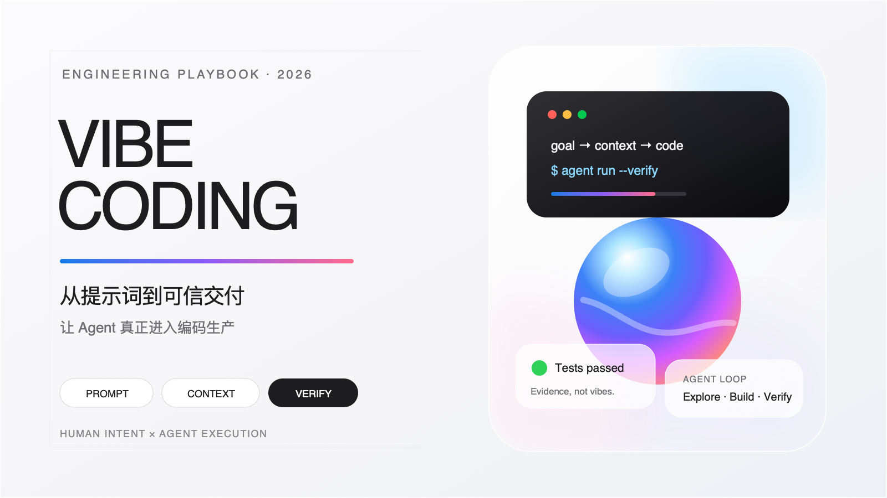

# 从 Vibe Coding 到 Verified Coding：让 Agent 真正进入编码生产的最佳实践

> **优秀的提示词，不是写得更长，而是让 Agent 更少猜测、更敢执行、更容易验证。**

Vibe Coding 降低了编程的表达门槛：人用自然语言描述意图，Agent 阅读代码、调用工具、修改文件并运行测试。但如果只是不断说“帮我加一个功能”“这里不对，再改一下”，最终得到的往往是一个能演示、难维护、不可验证的代码堆。

真正适合生产环境的 Vibe Coding，不应当是“凭感觉生成代码”，而应该升级为：

> **人负责目标、约束、决策和验收；Agent 负责探索、实现、验证和交付。**

换句话说，我们要追求的不是纯粹的 Vibe Coding，而是 **Verified Coding——可验证的智能编码**。

---

## 一、什么样的提示词才算优秀？

OpenAI 官方文档将提示工程定义为：编写有效指令，使模型能够更稳定地产出符合要求的结果。对于推理模型，官方建议提示词保持简单、直接，使用清晰的分隔结构，明确约束和最终成功标准，而不是反复要求模型“逐步思考”。

我认为，一个优秀的编码提示词，本质上是一份**微型任务合同**。它至少应当回答六个问题：

1. **目标是什么？**
2. **当前状态是什么？**
3. **允许修改什么？**
4. **不能破坏什么？**
5. **怎样才算完成？**
6. **完成后需要交付什么证据？**

可以将其概括为：

> **目标 + 背景 + 边界 + 验收 + 权限 + 交付**

### 1. 目标：描述结果，而不是泛泛描述动作

差的目标：

```text
帮我优化一下登录模块。
```

这里的“优化”可能意味着：

- 提高性能；
- 修复错误；
- 改善代码结构；
- 增加安全性；
- 重做交互；
- 修改接口；
- 更新依赖。

Agent 无法知道你真正关心什么，只能自行猜测。

更好的目标：

```text
修复用户首次登录时偶发重复提交的问题。

完成后：
1. 快速连续点击登录按钮只发送一次请求；
2. 请求进行中按钮显示 loading 并不可重复点击；
3. 请求失败后恢复可操作状态；
4. 不改变现有登录接口、路由跳转和错误提示文案。
```

优秀提示词首先要做到：**把主观期待转换成可观察行为。**

---

### 2. 背景：告诉 Agent 为什么改，而不只是改哪里

Agent 最容易出错的地方，不是不会写代码，而是误判业务意图。

例如，你只说：

```text
把订单状态改成 completed。
```

Agent 不知道这是：

- 修改数据库字段；
- 修复前端展示；
- 调整状态机；
- 修改测试数据；
- 还是兼容第三方回调。

有效背景应包含：

```text
现象：
支付回调成功后，数据库中的订单已经是 paid，
但订单详情页仍显示 processing。

预期：
前端应将 paid 映射为“已支付”，不能修改后端状态枚举。

已知线索：
问题可能位于订单详情页的状态映射层，
不是支付回调处理逻辑。
```

**文件路径是上下文，业务原因也是上下文。** 只给文件，不给意图，Agent 可能正确修改了错误的地方。

---

### 3. 边界：明确什么不能动

Agent 能力越强，越需要明确边界。

如果只说“解决这个问题”，Agent 可能顺手：

- 升级依赖；
- 重构公共组件；
- 修改接口；
- 改变数据库结构；
- 删除它认为无用的兼容逻辑；
- 格式化大量无关文件。

因此提示词应明确：

```text
范围：
- 仅修改前端订单状态展示逻辑；
- 可以增加相关单元测试；
- 不修改服务端状态定义；
- 不升级依赖；
- 不重构无关组件；
- 保留当前未提交修改；
- 如果发现必须扩大范围，先说明原因，不要直接实施。
```

边界不是为了限制 Agent 的能力，而是为了减少无效探索和意外改动。

---

### 4. 验收：把“我觉得可以”变成机器可判断的标准

最差的验收方式是：

> “看起来差不多了。”

OpenAI 的评估指南将这种仅凭感觉判断效果的方式列为反模式，并建议明确评估目标、数据、指标，持续在变更后运行评估。

编码任务的验收标准最好包括三层：

#### 行为验收

```text
- 连续点击只产生一个请求；
- 请求失败后可以重新提交；
- 成功后的跳转行为不变。
```

#### 自动化验收

```text
- 增加重复点击的回归测试；
- 现有登录测试全部通过；
- typecheck、lint 和相关测试通过。
```

#### 变更验收

```text
- 不包含无关文件；
- 不新增生产依赖；
- 不修改公开接口；
- git diff --check 通过。
```

**测试命令就是 Agent 可以执行的验收协议。**

---

### 5. 权限：告诉 Agent 可以自主做什么

许多低效对话并不是模型能力不足，而是权限边界模糊：

- Agent 不知道能否修改代码，于是一直解释；
- 不知道能否运行测试，于是修改后就停止；
- 不知道能否安装依赖，于是擅自修改 lockfile；
- 不知道能否提交或部署，于是做了外部写入。

建议将权限分成三层：

```text
可以自主执行：
- 阅读仓库文件；
- 搜索调用链；
- 修改本任务范围内的代码；
- 增加相关测试；
- 运行非破坏性检查；
- 检查 git diff。

必须先确认：
- 添加或升级生产依赖；
- 数据库迁移；
- 修改公开 API；
- 删除兼容逻辑；
- 修改 CI、部署或权限配置；
- 推送代码、创建 PR、发布或部署；
- 任何破坏性操作。
```

安全、局部、可恢复的操作可以授权 Agent 连续完成；外部写入、破坏性操作、付费操作及重大范围扩张应要求确认。

---

### 6. 交付：不要只要代码，要证据

一个生产级 Agent 的最终回答不应该只是：

> “已经修复完成。”

你应该要求它报告：

```text
完成后请提供：
1. 根因；
2. 修改方案；
3. 关键变更文件；
4. 实际运行的验证命令；
5. 每条命令的结果；
6. 未验证部分和剩余风险；
7. 是否存在未提交或无关改动。
```

这会迫使 Agent 从“代码生成器”转变为“对交付结果负责的工程执行者”。

---

## 二、提示词是不是越详细越好？

不是。

详细和冗长不是一回事。

一个优秀提示词应当：

- 详细描述**目标和边界**；
- 简洁描述**执行方式**；
- 避免重复同一条规则；
- 避免规定无意义的思考仪式；
- 避免塞入与任务无关的背景；
- 只提供真正相关的工具和资料。

OpenAI 最新官方指南指出，在一组内部编码 Agent 评测中，精简重复指令、示例和工具描述后，评测分数方向性提高约 10%–15%，同时显著降低 token 和成本；但具体收益仍需在自己的真实任务上评估。

所以，优秀提示词不是“把所有细节都写进去”，而是：

> **把必须遵守的事实写清楚，把可以自行判断的过程交给 Agent。**

不要写：

```text
先思考第一步，然后思考第二步，检查三遍，
再从五种方案中选择一个最优方案……
```

更适合的写法是：

```text
先检查当前实现和相关测试，再选择最小可行修改。
不要根据文件名猜测调用关系。
完成后运行相关验证，并用文件路径、测试结果和 diff 作为结论依据。
```

我们需要的是**可审查的证据**，而不是模型完整的内部思维过程。

---

## 三、Vibe Coding 的核心不是 Prompt Engineering，而是 Context Engineering

很多人花大量时间研究一句“万能提示词”，却忽略了 Agent 的表现取决于整个工作系统。

可以用一个公式表达：

> **Agent 生产力 = 模型能力 × 上下文质量 × 工具完备度 × 验收闭环 × 权限设计**

任何一项接近零，整体效果都会大幅下降。

### 1. 将稳定规则放进仓库，而不是每次重复

对于长期项目，应建立类似 `AGENTS.md` 的仓库说明，记录：

- 项目定位；
- 目录边界；
- 首先阅读哪些文件；
- 构建和测试命令；
- 编码规范；
- 哪些模块不能相互依赖；
- 哪些操作需要确认；
- Definition of Done；
- 提交与交付要求。

推荐的结构：

```markdown
# 项目定位

这个项目解决什么问题，目前处于什么阶段。

# 阅读顺序

1. README.md
2. docs/architecture.md
3. 对应功能目录的 README

# 架构边界

- UI 不直接访问数据库
- feature 不依赖另一个 feature 的内部实现
- 公共代码进入 shared 前必须存在多个稳定使用方

# 工作方式

- 先检查 git status 和相关 diff
- 先复现，再修改
- 只做最小范围变更
- 保留用户已有修改

# 验证命令

- 前端：pnpm test && pnpm typecheck
- 后端：cargo test
- 完整检查：pnpm check

# 权限

- 添加依赖、迁移、部署、推送必须确认
```

原则是：

> **稳定知识进入仓库，单次需求留在任务提示词中。**

---

### 2. 让 Agent 先探索，再修改

生产级任务不要让 Agent 根据描述盲改。

推荐工作流：

```text
复现问题
→ 阅读相关入口
→ 追踪调用链
→ 确认根因
→ 制定最小方案
→ 修改代码
→ 运行测试
→ 审查 diff
→ 汇报证据
```

对于低风险、范围清晰的任务，可以授权 Agent 连续完成整个闭环；对于迁移、权限、安全、支付等高风险任务，则应先让它提交调查结论和实施计划。

关键不是所有任务都必须“先写长计划”，而是：

> **修改应当建立在仓库事实之上，而不是建立在文件名和经验猜测之上。**

---

### 3. 把需求拆成小而完整的闭环

差的拆分：

```text
第一步：创建文件
第二步：写接口
第三步：写组件
```

这种拆分是按代码动作切割，单独任何一步都无法验收。

更好的拆分：

```text
任务一：用户能够提交表单，并覆盖成功、校验失败和网络失败。
任务二：提交结果能够持久化，并覆盖重复请求和权限失败。
任务三：管理员能够查看结果，并覆盖空状态和分页。
```

每个任务都应具备：

- 一个明确用户结果；
- 一个有限修改范围；
- 一组可执行验证；
- 一个可以独立审查的 diff。

**最适合 Agent 的任务，不一定最小，但必须边界清晰、可以独立验收。**

---

### 4. 用测试代替重复解释

如果一条规则非常重要，最可靠的做法不是把它在提示词中重复三遍，而是将其变成：

- 单元测试；
- 集成测试；
- 类型约束；
- Schema；
- lint 规则；
- 快照；
- 性能预算；
- CI 检查。

自然语言告诉 Agent“你想要什么”，测试告诉 Agent“什么时候可以停止”。

例如：

```text
先为该缺陷增加一个能够失败的回归测试，
确认测试在当前实现上失败，再进行修复。
修复后运行该测试和相关测试集。
不要为了让测试通过而降低断言强度。
```

这是 Agent 编码中最有价值的提示模式之一，因为它建立了自动反馈循环：

```text
实现 → 执行 → 观察失败 → 调整 → 再验证
```

---

### 5. 将 Agent 从代码生成器升级为闭环执行者

低效使用方式：

```text
人：写一段代码。
Agent：输出代码。
人：复制运行。
人：把错误贴回来。
Agent：再猜一次。
```

高效使用方式：

```text
人：定义目标、范围、权限和验收。
Agent：阅读、修改、运行、诊断、再修改、验证、汇报。
人：审查关键决策和最终证据。
```

只让 Agent 生成补丁，你得到的是更快的打字工具。

让 Agent 操作真实仓库、运行真实命令、读取真实错误、检查真实 diff，你得到的才是工程杠杆。

---

## 四、如何正确使用多 Agent？

多 Agent 不是“Agent 越多越强”，而是将真正独立的工作并行化。

适合并行的任务：

- 一个 Agent 追踪前端调用链；
- 一个 Agent 追踪后端调用链；
- 一个 Agent 梳理测试缺口；
- 一个 Agent 检查安全风险；
- 一个 Agent 分析日志或历史变更。

不适合并行的任务：

- 多个 Agent 同时修改同一组文件；
- 后一个任务依赖前一个任务的设计结论；
- 需求本身还没有确定；
- 工作量很小，协调成本高于执行成本。

并行工作更适合代码探索、测试、问题分类、日志分析和总结等读密集任务；并行写代码则需要更加谨慎，因为可能产生冲突和额外协调成本。多 Agent 也会消耗更多 token，因此应当只在任务能够真正独立时使用。

一个好的多 Agent 提示词应明确：

```text
并行启动三个只读审查任务：

1. 安全：检查鉴权、输入校验和敏感信息风险；
2. 测试：检查回归测试、失败路径和边界条件；
3. 可维护性：检查耦合、重复逻辑和公共接口变化。

三个 Agent 都不得修改文件。
主 Agent 等待全部结果后，去重、验证并按严重程度汇总。
每项结论必须包含文件路径和证据。
```

原则是：

> **子 Agent 负责扩大调查带宽，主 Agent 负责决策和集成。**

---

## 五、Agent 编码生产的标准闭环

一套成熟的生产流程可以分为七个阶段。

### 第一阶段：定义任务

人类提供：

- 用户问题；
- 业务目标；
- 范围；
- 不变量；
- 验收标准；
- 风险等级。

### 第二阶段：建立事实

Agent 执行：

- 检查工作区状态；
- 阅读项目说明；
- 搜索入口和调用链；
- 查看现有测试；
- 复现问题；
- 区分事实与假设。

### 第三阶段：确定方案

Agent 输出或内部确定：

- 根因；
- 最小修改位置；
- 接口影响；
- 兼容性影响；
- 测试方案；
- 是否需要用户决策。

### 第四阶段：实施

Agent：

- 只修改任务范围内的文件；
- 保留已有改动；
- 同步更新测试；
- 不进行无关重构；
- 不为了绕过失败而降低质量门槛。

### 第五阶段：验证

验证顺序建议从快到慢：

```text
目标测试
→ 相关测试集
→ 类型检查
→ lint / 静态分析
→ 构建
→ 集成或端到端测试
→ 完整检查
```

### 第六阶段：独立审查

让 Agent 切换视角检查：

- 功能是否真的满足需求；
- 是否遗漏失败路径；
- 是否引入兼容性问题；
- 是否存在安全或并发问题；
- 测试是否只验证了实现，而没有验证需求；
- diff 是否包含无关改动。

复杂任务可以让另一个 Agent 进行只读审查，避免实现者对自己的方案产生确认偏差。

### 第七阶段：交付证据

最终报告至少包含：

```text
- 根因
- 实现摘要
- 关键文件
- 接口或行为变化
- 验证命令及实际结果
- 未运行的检查及原因
- 剩余风险
- 工作区和 Git 状态
```

---

## 六、可以直接使用的生产级提示词模板

```text
# 目标

修复/实现：[描述用户可观察的最终结果]

成功后应满足：
1. [...]
2. [...]
3. [...]

# 当前状态

现象：
[...]

预期：
[...]

已知线索：
[...]

相关资料：
- [...]
- [...]

# 工作方式

先检查当前工作区和项目说明，再阅读相关入口、调用链和测试。
不要根据文件名猜测实现。
先确认当前行为和根因，然后实施最小范围修改。

如果现有代码已经满足需求，请提供证据，不要为了产生 diff 而修改代码。

# 范围与约束

允许：
- 修改 [...]
- 增加相关测试
- 运行非破坏性验证

禁止：
- 修改 [...]
- 升级或新增生产依赖
- 重构无关代码
- 覆盖已有未提交修改
- 降低测试、类型或 lint 标准

如果必须扩大范围，先说明原因和影响。

# 验收标准

行为：
- [...]
- [...]

自动化验证：
- [...]
- [...]

质量：
- 不包含无关变更
- 保持现有公开接口兼容
- 相关失败路径有测试
- diff 检查通过

# 权限

可以直接执行本任务范围内的本地修改和非破坏性测试。

以下操作必须先确认：
- 添加依赖
- 数据迁移
- 删除数据或文件
- 修改权限、CI 或部署配置
- 推送、创建 PR、发布或部署

# 交付格式

完成后报告：
1. 根因或设计依据；
2. 实现摘要；
3. 修改文件；
4. 实际运行的验证命令和结果；
5. 未验证部分；
6. 剩余风险；
7. 当前 Git 状态。
```

这个模板不需要每次全部填写。简单任务可以缩短，但**目标、边界和验收标准不应缺失**。

---

## 七、常见反模式

### 1. 只描述动作，不描述结果

```text
增加一个 UserService。
```

Agent 不知道为什么增加、由谁调用、成功标准是什么。

### 2. 一次要求完成整个产品

```text
帮我做一个类似抖音的应用。
```

这适合原型探索，不适合生产交付。应先定义最小用户闭环。

### 3. 用形容词代替标准

```text
代码优雅一点。
性能好一点。
界面高级一点。
```

应该转化为结构、指标、参考图或明确行为。

### 4. 没有失败路径

只要求“成功登录”，却没有说明：

- 超时；
- 重复请求；
- 密码错误；
- token 过期；
- 服务不可用；
- 组件卸载后的异步回调。

生产问题往往发生在失败路径，而不是理想路径。

### 5. 没有授权 Agent 验证

如果提示词只说“写代码”，Agent 很可能写完就停。

应该明确：

```text
完成后直接运行相关测试和检查；
若失败，继续诊断并修复，直到通过或确认存在外部阻塞。
```

### 6. 把所有信息都塞进一个无限增长的会话

会话越长，不等于上下文越好。

当目标已经改变、旧日志失去价值、决策发生反转时，应当：

- 总结已经确认的事实；
- 将稳定规则写入项目文档；
- 用新的、干净的任务开启后续工作；
- 不要让过期讨论持续污染上下文。

### 7. 把“生成了代码”当作“完成了任务”

未运行的测试不是通过。

Mock 测试通过不等于真实服务通过。

构建成功不等于功能正确。

代码存在不等于用户目标已实现。

---

## 八、如何衡量 Agent 是否真正提升了生产力？

不要只统计 Agent 写了多少行代码。

更有意义的指标包括：

- 首次交付通过率；
- 平均返工轮数；
- 从需求到可审查 diff 的时间；
- 人工审查时间；
- 回归缺陷率；
- Agent 引入的无关变更比例；
- 测试覆盖的失败路径数量；
- 每个完成任务的 token、成本和耗时；
- 需要人类介入的决策类型；
- Agent 声称完成但缺少验证证据的比例。

最重要的指标不是“代码生成速度”，而是：

> **从清晰意图到可信交付的时间。**

---

## 结语：把人的能力上移，把 Agent 的责任下沉

Vibe Coding 的终点，不是程序员彻底不看代码，也不是把需求随口说给模型后等待奇迹。

真正高效的人机协作是：

### 人类负责

- 定义问题；
- 解释业务；
- 决定取舍；
- 设定架构边界；
- 识别高风险操作；
- 制定验收标准；
- 审查最终证据。

### Agent 负责

- 阅读代码库；
- 追踪真实调用链；
- 搜索相关实现；
- 编写和修改代码；
- 运行测试；
- 分析错误；
- 迭代修复；
- 检查 diff；
- 汇总交付结果。

因此，一个优秀提示词从来不是一句神奇咒语，而是一个压缩后的工程协议：

> **告诉 Agent 终点在哪里，提供理解问题所需的事实，划清不能越过的边界，赋予合理的执行权限，并用可运行的验收标准判断它是否真正到达。**

当项目上下文、工具权限、任务拆分、测试反馈和交付流程都围绕这个原则设计时，Agent 才不再只是一个“会补全代码的聊天机器人”，而会逐渐成为一个能够调查、实现、验证并对结果负责的数字工程师。

**Vibe 负责启动创造力，工程纪律负责把它送进生产环境。**

---

## 参考资料

- [OpenAI Prompt Engineering](https://developers.openai.com/api/docs/guides/prompt-engineering)
- [OpenAI Reasoning Best Practices](https://developers.openai.com/api/docs/guides/reasoning-best-practices)
- [OpenAI Evaluation Best Practices](https://developers.openai.com/api/docs/guides/evaluation-best-practices)
- [OpenAI Latest Model Guide](https://developers.openai.com/api/docs/guides/latest-model)
- [Codex AGENTS.md Guide](https://developers.openai.com/codex/agent-configuration/agents-md)
- [Codex Subagents Guide](https://developers.openai.com/codex/agent-configuration/subagents)
