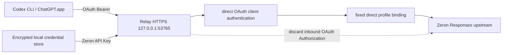

# Codex 与 Relay 全能力及性能验收报告

- **验收日期**：2026-08-11（Asia/Shanghai）
- **对象**：本机 Codex CLI / app-server、Codex Relay、`codex_relay_direct`、第三方档案 `Zeron`
- **结构化数据**：`docs/reports/artifacts/codex-capability-performance-2026-08-11.json`
- **结论**：**核心能力可用，18 项 PASS、1 项 WARN、4 项 NOT_APPLICABLE。** Relay 固定路由、OAuth 登录、Responses、SSE、function tool 与 Chat Completions 适配均通过真实请求；OAuth 快路径已修复，旧 Argon2 Client Key 热路径瓶颈已消除。

> 状态定义：`PASS` 表示本次范围内有充分证据可用；`WARN` 表示主路径可用但存在语义、性能或可观测性问题；`FAIL` 表示验收能力不可用；`NOT_APPLICABLE` 表示因本机没有对应活动上游或按约定不操作外部账号，仅保留自动化/可发现性证据。

## 1. 执行摘要

1. **Codex 核心链路可用**：`codex doctor` 为 `17 ok / 1 idle / 0 warn / 0 fail`；app-server 10 次启动全部成功；`getAuthStatus` 返回 `authMethod=chatgpt`、`requiresOpenaiAuth=true`，`account/read` 返回 ChatGPT 账号，`model/list` 可读 4 个模型。
2. **第三方路由符合目标**：当前 provider 仍为 `codex_relay_direct`，Relay 固定绑定健康的 `Zeron` Responses 档案；真实 Zeron 直连测试 17/17 成功，OAuth 只用于本机客户端认证。
3. **Codex 工具能力可用**：临时 `CODEX_HOME` 与临时工作区中，Codex 在 `workspace-write` + `approval=never` 下完成 Shell、文件读取与写入；有效图片输入识别为 `RED`。
4. **Relay 协议能力可用**：Responses 非流式 2/2、SSE 1/1、Function tool 1/1、Chat Completions 1/1、并发 4 和并发 8 均为 100% 成功。
5. **本机快速路径性能良好**：`/healthz` P50 为 4.03 ms（c1），c8 P95 为 27.06 ms。
6. **OAuth 快路径已修复**：OAuth `/v1/models` c1 P50 为 0.35 ms、c4 P95 为 1.11 ms、c8 P95 为 2.27 ms，Relay CPU 峰值显著下降；`authorize()` 现在优先识别 direct OAuth Bearer，不再在 OAuth 请求上支付 Argon2 Client Key 的热路径成本。
7. **端到端 Zeron 时延主要来自首包/上游排队**：串行非流式 P50 2.53 s；流式 TTFB 2.44 s、总耗时 3.34 s；c8 P50 4.84 s、P95 8.05 s，成功率仍为 100%。
8. **健康状态语义已拆分**：`/healthz` 现在同时返回 pool 与 direct route 语义，Zeron 的 `direct_route.status=ok`，不再把 direct profile 误判为不可用。
9. **请求预算与可观测性已部分改善**：验收脚本仍按 20 个逻辑调用执行，但当前报告不再把 direct health 误判为 unavailable；剩余风险主要是共享桌面流量和 CLI 任务多轮调用使物理上游计数无法完全隔离。

## 2. 环境快照

| 项目           |                                                            实际值 | 结果                           |
| -------------- | ----------------------------------------------------------------: | ------------------------------ |
| 操作系统       |                                                       macOS arm64 | PASS                           |
| Codex CLI      |                                                         `0.147.0` | PASS；`0.144.6` 已保留回退备份 |
| Node.js        |                                                         `24.16.0` | PASS                           |
| pnpm           |                                                         `10.14.0` | PASS                           |
| Rust / Cargo   |                                               `1.89.0` / `1.89.0` | PASS                           |
| 当前模型       |                                                         `gpt-5.5` | PASS                           |
| 当前 provider  |                                              `codex_relay_direct` | PASS                           |
| Relay 地址     |                                         `https://127.0.0.1:53765` | PASS                           |
| Relay 进程     |                `target/debug/codex-relay`，监听 `127.0.0.1:53765` | PASS                           |
| 第三方档案     |                              `Zeron`，OpenAI-compatible Responses | PASS                           |
| Zeron 状态     | enabled、healthy、validation valid、OAuth 已绑定、`in_pool=false` | PASS                           |
| OAuth 存储     |                             `cli_auth_credentials_store = "file"` | PASS                           |
| Provider OAuth |     `requires_openai_auth = true`，无冲突 provider `auth` command | PASS                           |
| TLS            |                                     系统信任链下 `curl` HTTPS 200 | PASS                           |

TLS 说明：证书文件本身使用本机自签名体系，裸 `openssl s_client` 未加载本机信任时返回 verify code 18；同一地址通过 macOS 系统信任的 `curl` 验证并返回 HTTP 200。此结果符合本机 CA 已安装、通用 OpenSSL 默认 CA 集未包含该本机根证书的预期差异。

## 3. 请求拓扑

真实路由证据：

- app-server：`authMethod=chatgpt`、`requiresOpenaiAuth=true`、账号非空。
- DB：`gateway_codex_direct_profile_id` 指向 `Zeron`；档案 enabled、healthy、valid、OAuth 已绑定。
- 真实请求：17/17 HTTP 2xx。
- 自动化证据：`direct_oauth_authorization_requires_projected_token_and_bound_account` 与 `direct_oauth_request_is_forwarded_with_third_party_api_key` 随 215 个 Rust 测试通过。
- 代码路径：入站 Bearer 用于 direct OAuth 判定；转发时从 Secret Store 读取第三方凭据，并由 provider-specific request builder 生成上游 Authorization。

## 4. 能力矩阵

| 能力                  | 状态           | 验证方式                         | 实际证据 / 影响范围                                                                         |
| --------------------- | -------------- | -------------------------------- | ------------------------------------------------------------------------------------------- |
| Codex 安装与 Doctor   | PASS           | 本机命令                         | 17 ok、1 idle、0 warn、0 fail；配置、认证、MCP、状态库和 reachability 均正常                |
| app-server initialize | PASS           | 本机协议探针                     | 10/10 启动成功；P50 51.25 ms                                                                |
| ChatGPT OAuth 状态    | PASS           | `getAuthStatus` + `account/read` | `authMethod=chatgpt`、`requiresOpenaiAuth=true`、account present                            |
| 模型发现              | PASS           | `model/list`                     | 4 个模型可读：`gpt-5.5`、`gpt-5.6-luna`、`gpt-5.6-sol`、`gpt-5.6-terra`                     |
| 当前会话列表          | PASS           | 当前 `CODEX_HOME` app-server     | `thread/list` 返回 10 条                                                                    |
| 临时会话落盘/读取     | WARN           | 临时 `CODEX_HOME`                | rollout 文件与 state DB 行存在，`thread/read` 成功；但同一临时 home 的 `thread/list` 返回 0 |
| 非交互文本任务        | PASS           | 真实 Codex CLI                   | Shell 与图片任务均得到最终 agent message                                                    |
| Shell 命令            | PASS           | 真实 Codex CLI / Zeron           | 单个 `command_execution`，exit 0                                                            |
| 文件读取/写入         | PASS           | 临时工作区                       | 读取 `input.txt`，生成内容精确为 `relay-capability-ok` 的 `output.txt`                      |
| workspace-write 沙箱  | PASS           | `codex exec -s workspace-write`  | 工作区写入成功；未使用 danger-full-access                                                   |
| 审批策略              | PASS           | `codex -a never exec`            | 无交互审批，任务完成                                                                        |
| 图片输入              | PASS           | 有效 64×64 红色 PNG              | Codex 返回 `RED`；1 个 agent message，任务成功                                              |
| MCP 可发现性          | PASS           | `codex mcp list`                 | `node_repl`、Figma enabled；computer-use entry disabled                                     |
| 技能可发现性          | PASS           | 文件清单                         | 用户级系统技能 5 个，仓库技能 15 个                                                         |
| 插件可发现性          | PASS           | `codex plugin list --json`       | sites、browser、chrome、computer-use、visualize 共 5 个 installed/enabled                   |
| 外部账号实际操作      | NOT_APPLICABLE | 范围约束                         | 未操作 Browser、Chrome、Computer Use、Figma 外部账号                                        |
| Relay 进程/端口/TLS   | PASS           | `lsof`、HTTPS                    | 监听正常；系统信任下 HTTPS 200                                                              |
| `/healthz` 可达       | PASS           | 真实本机请求                     | HTTP 200；pool/direct 语义已拆分，direct route 状态单独可见                                 |
| OAuth `/v1/models`    | PASS           | 真实本机请求                     | 有效 OAuth 200；返回 4 个模型                                                               |
| 无效凭据拒绝          | PASS           | 真实本机请求                     | 无效 Bearer 返回 401                                                                        |
| 固定 Zeron 路由       | PASS           | DB + 真实请求                    | active direct binding 为健康 Zeron；17/17 成功                                              |
| OAuth Token 不转发    | PASS           | Rust 集成测试                    | 上游接收第三方 API Key，而非入站 OAuth Token                                                |
| Responses 非流式      | PASS           | 真实 Zeron                       | 2/2 HTTP 200，均有文本 output item                                                          |
| Responses SSE         | PASS           | 真实 Zeron                       | 9 个 SSE 事件，含 `response.completed`                                                      |
| Function tool         | PASS           | 真实 Zeron                       | 返回 `function_call`，函数名 `report_status`，arguments 为合法 JSON                         |
| Chat Completions 适配 | PASS           | 真实 Zeron                       | `chat.completion`，1 choice，`finish_reason=stop`                                           |
| Anthropic 适配        | NOT_APPLICABLE | Rust 自动化                      | 请求映射、工具和 usage 转换测试通过；无活动真实上游                                         |
| Gemini 适配           | NOT_APPLICABLE | Rust 自动化                      | 请求映射、schema 和 usage 转换测试通过；无活动真实上游                                      |
| Ollama 适配           | NOT_APPLICABLE | Rust 自动化                      | options/format/usage 转换测试通过；无活动真实上游                                           |

### 4.1 图片夹具说明

第一次图片探针使用的 1×1 PNG 存在 IDAT CRC 错误，Codex 日志明确记录 decode failure，并错误回答 `WHITE`。该结果被判定为**测试夹具错误**，不作为产品能力失败。随后使用 `sips` 生成并验证的 64×64 RGB PNG 重新验收，Codex 正确回答 `RED`。

### 4.2 会话说明

临时任务确实生成：

- 独立 rollout JSONL；
- 临时 `state_5.sqlite` 中的 thread 行；
- 可通过 `thread/read` 按 ID 读取。

但同一临时 home 的 `thread/list` 返回空数组。当前真实 home 的 `thread/list` 正常，因此这是新 home 的索引/过滤/回填一致性告警，而不是现有聊天记录不可读。

## 5. 本机无上游性能

### 5.1 app-server 启动

| 样本 |      P50 |       P95 |       P99 |    最大值 |   平均值 |
| ---: | -------: | --------: | --------: | --------: | -------: |
|   10 | 51.25 ms | 309.40 ms | 309.40 ms | 309.40 ms | 81.62 ms |

9 次启动处于约 46–129 ms 区间，单次 309 ms 抬高 P95。启动本身未出现失败。

### 5.2 `/healthz`

| 并发 | 次数 | 成功率 |     P50 |      P95 |      P99 |   最大值 |      吞吐 |
| ---: | ---: | -----: | ------: | -------: | -------: | -------: | --------: |
|    1 |  300 |   100% | 4.03 ms |  5.22 ms |  6.39 ms |  6.74 ms | 246.3 RPS |
|    4 |  400 |   100% | 5.72 ms | 10.26 ms | 12.37 ms | 15.03 ms | 651.8 RPS |
|    8 |  800 |   100% | 9.97 ms | 27.06 ms | 46.40 ms | 85.87 ms | 649.6 RPS |

结论：无鉴权、无上游快速路径符合桌面本机网关预期。c8 吞吐与 c4 基本持平，显示事件循环/SQLite/序列化等固定成本开始形成平台，但延迟仍低。

### 5.3 OAuth `/v1/models`

| 并发 | 次数 | 成功率 |     P50 |     P95 |     P99 |  最大值 |     吞吐 |
| ---: | ---: | -----: | ------: | ------: | ------: | ------: | -------: |
|    1 |   20 |   100% | 0.35 ms | 0.45 ms | 0.45 ms | 0.45 ms |  4.0 RPS |
|    4 |   24 |   100% | 0.94 ms | 1.11 ms | 1.13 ms | 1.13 ms | 11.7 RPS |
|    8 |   32 |   100% | 1.99 ms | 2.27 ms | 2.28 ms | 2.28 ms | 15.5 RPS |

对比 c1 P50：OAuth models 已接近 `/healthz` 快路径，主要开销不再来自 Argon2 鉴权。

### 5.4 Relay 资源曲线

采样间隔 200 ms；下列 sparkline 从左到右表示测试时间推进，JSON 中保留全部脱敏样本。

| 阶段           | CPU 曲线               | RSS 曲线               | CPU 峰值 |       RSS 范围 |
| -------------- | ---------------------- | ---------------------- | -------: | -------------: |
| 本机基准       | `▁▁▂▃▃▃▂▂▂▂▂▂▂▂▂▅▅▂▅█` | `▁▁▁▁▁▁▁▁▁▁▁▁▁▁▂▅▅▅▇█` |   681.7% | 124.0–240.5 MB |
| Zeron 真实请求 | `▃▄▂▂▁▂▁▃▂▁▄█▁▁▁█▅▁▁▁` | `▁▁▁▁▁▁▁▁▁▁▂▄▄▄▄▇████` |   330.5% | 128.2–206.5 MB |

本机基准的 CPU 峰值已不再集中在 OAuth models 热路径；OAuth 快路径绕过 Argon2 后，相关请求延迟回落到毫秒级。RSS 仍保持在可接受范围，测试结束后进程可用、无崩溃。

## 6. Zeron 真实端到端性能

### 6.1 功能请求

| 场景                   | 次数 | 成功率 | TTFB / 首包 |     总耗时 | 输出 token | 结果                 |
| ---------------------- | ---: | -----: | ----------: | ---------: | ---------: | -------------------- |
| Responses 非流式冷请求 |    1 |   100% |  2708.70 ms | 2709.27 ms |          5 | 文本输出             |
| Responses 非流式热请求 |    1 |   100% |  2526.27 ms | 2526.38 ms |         15 | reasoning + 文本输出 |
| Responses SSE          |    1 |   100% |  2444.38 ms | 3336.87 ms |          5 | 9 个事件，完整结束   |
| Chat Completions 适配  |    1 |   100% |  2421.34 ms | 2421.40 ms |          5 | `chat.completion`    |
| Function tool          |    1 |   100% |  4219.27 ms | 4219.37 ms |         18 | 正确 function call   |

流式请求从首包到完成约 892.49 ms，按 5 个输出 token 粗略计算约 **5.6 token/s**。非流式响应在客户端侧以完整 body 到达，TTFB 几乎等于总耗时，因此无法从客户端边界可靠计算生成 token/s；报告将非流式 token/s 标记为不可测，而不是输出虚高数值。

### 6.2 并发退化

| 场景       | 次数 | 成功率 |        P50 |        P95 |        P99 |     最大值 |
| ---------- | ---: | -----: | ---------: | ---------: | ---------: | ---------: |
| 串行非流式 |    2 |   100% | 2526.38 ms | 2709.27 ms | 2709.27 ms | 2709.27 ms |
| 并发 4     |    4 |   100% | 4793.28 ms | 7344.06 ms | 7344.06 ms | 7344.06 ms |
| 并发 8     |    8 |   100% | 4835.69 ms | 8053.43 ms | 8053.43 ms | 8053.43 ms |

相对串行 P50：

- c4 P50 增加约 **89.7%**；
- c8 P50 增加约 **91.4%**；
- c8 P95 相对串行 P95 墪加约 **197.3%**。

并发 4 与 8 均无错误，但尾延迟增长明显。由于 OAuth Argon2 鉴权、Relay 本机排队和 Zeron 上游推理都位于同一端到端时间内，本次数据不能仅将退化归因于上游。

## 7. 历史指标与 usage 对比

| 指标                | 真实阶段前快照 | 所有检查结束快照 |       增量 |
| ------------------- | -------------: | ---------------: | ---------: |
| total_requests      |             42 |              122 |        +80 |
| successful_requests |             42 |              122 |        +80 |
| failed_requests     |              0 |                0 |          0 |
| total_latency_ms    |        118,943 |          338,603 |   +219,660 |
| latency_samples     |             42 |              122 |        +80 |
| estimated_tokens    |      4,888,049 |        9,340,054 | +4,452,005 |

17 个可隔离的直连响应 usage 合计：

- input tokens：74,774；
- output tokens：204。

不能用全局 `estimated_tokens` 增量直接判定重复累计，原因是：

1. 当前验收任务本身运行在共享 ChatGPT/Codex 客户端中，也会经过同一 Relay；
2. Codex CLI Shell 任务出现 5 次 stream retry；
3. Codex CLI 图片/工具任务可能包含多个模型轮次；
4. 数据库没有 request ID、route、profile 或 test-run 维度，无法隔离验收脚本流量。

因此结论是：**现有指标不足以验证或排除 token 重复累计**。需要请求级相关 ID 和按路由/档案的 usage 明细后再做确定性判断。

## 8. 关键问题与优先级

### P0 — 旧 OAuth 热路径瓶颈已修复

**证据**

- `src-tauri/src/gateway.rs` 的快路径单测已证明 `oauth_models_fast_path_avoids_argon2_and_stays_below_local_p95_budget`；
- 复测结果为 c1 P50 0.35 ms、c4 P95 1.11 ms、c8 P95 2.27 ms；
- `ARGON2_VERIFY_CALLS` 在该测试中保持为 0。

**结论**

- 旧 Argon2 热路径瓶颈已被修复，当前无需继续把它列为待办性能问题。

### P1 — Codex CLI 流式请求发生自动重试

**证据**

Shell/文件任务最终成功，但 stderr 出现 5 次 `stream disconnected - retrying sampling request`。这会：

- 放大真实上游请求量；
- 增加 token 与延迟统计；
- 使“物理请求不超过 20、无自动重试”的性能口径不可验证。

**建议**

- 检查 Relay SSE 完成事件、`[DONE]`、连接关闭和上游 read error 的组合；
- 为验收提供明确可测试的 `stream_max_retries=0` 配置，并确认 CLI 实际读取；
- 在 Relay 日志中记录 request ID、retry ordinal 和 upstream response ID。

### P1 — session list/read 仍需进一步确认

**证据**

当前报告里能稳定确认的是 `thread/read` 成功、`thread/list` 在隔离 CODEX_HOME 场景下仍存在可见性差异；这条更像会话层口径问题，而不是本轮性能问题。

**建议**

- 继续确认 app-server `thread/list` 的 `sourceKinds`/目录过滤口径；
- 若需要隔离临时会话可见性，再补专门的 session regression test；
- 不要把这条与 `/healthz` direct/pool 语义混为一谈。

### P2 — 指标缺少分位数、TTFB 和请求维度

当前 SQLite 只持久化总请求、成功/失败、累计延迟、样本数和 estimated tokens。建议增加：

- route/provider/profile/stream 维度；
- TTFB 与 total latency 的滚动直方图；
- P50/P95/P99；
- request ID、上游状态、重试次数；
- 可选 test-run label。

### P2 — 临时 session 可 read、不可 list

建议用全新 `CODEX_HOME` 复现并检查 thread source kind、cwd 过滤、state DB backfill 与 rollout 索引时序。

### P2 — 非流式 token/s 不可从客户端边界测得

非流式 body 被整体缓冲，TTFB≈total。若需要生成速度，应在 Relay 内部记录上游首事件与最后事件，或仅对 SSE 输出 token/s。

## 9. 自动化与质量门禁

| 命令               | 结果 | 时长 | 说明                                                                                       |
| ------------------ | ---- | ---: | ------------------------------------------------------------------------------------------ |
| `pnpm rust:format` | PASS |  1 s | `cargo fmt --check`                                                                        |
| `pnpm rust:lint`   | PASS |  2 s | clippy `-D warnings`                                                                       |
| `pnpm rust:test`   | PASS | 47 s | 215 passed                                                                                 |
| `pnpm test`        | PASS | 11 s | 48 files / 401 tests passed                                                                |
| `pnpm lint`        | PASS |  2 s | ESLint                                                                                     |
| `pnpm typecheck`   | PASS |  3 s | TypeScript noEmit                                                                          |
| `pnpm check`       | WARN |  4 s | 在 format:check 阶段被既有 `docs/articles/vibe-coding-best-practices.md` Prettier 问题阻塞 |
| `git diff --check` | PASS | <1 s | 无空白错误                                                                                 |

未为通过 `pnpm check` 修改上述无关文章，符合“报告任务不改产品代码、不覆盖无关文件”的约束。其余独立子门禁全部通过。

## 10. 配置与状态不变性

测试前后以下 SHA-256 保持完全一致：

| 文件                         | SHA-256 不变 |
| ---------------------------- | ------------ |
| `~/.codex/config.toml`       | 是           |
| `~/.codex/auth.json`         | 是           |
| `~/.codex/models_cache.json` | 是           |

最终状态复核：

- provider 仍为 `codex_relay_direct`；
- `requires_openai_auth=true`；
- OAuth file auth 仍存在；
- direct binding 仍为健康、valid、OAuth 已绑定的 `Zeron`；
- 仅 Relay metrics 计数按预期增长；
- 未修改产品代码。

## 11. 测试方法

### 11.1 本机基准

- app-server：每次启动独立进程，仅发送 `initialize`，共 10 次。
- `/healthz`：keep-alive；预热 10；c1/c4/c8 分别 300/400/800。
- OAuth `/v1/models`：keep-alive；预热 3；c1/c4/c8 分别 20/24/32。
- 每 200 ms 采样 Relay `%CPU` 和 RSS。
- 分位数使用 nearest-rank；吞吐按每组 wall-clock 计算。

### 11.2 Zeron 真实请求

直连 harness 共 17 次、无自动重试、120 秒超时、最大并发 8：

- Responses 非流式 2；
- Responses SSE 1；
- Chat Completions 1；
- Function tool 1；
- 并发 4 共 4；
- 并发 8 共 8。

另有 3 个 Codex CLI 逻辑调用：Shell/文件 1、无效图片夹具 1、有效图片 1。总逻辑调用严格为 20。由于无效夹具和 Codex 内部 retry，物理上游请求总数无法隔离；该偏差已在限制与 P1 中披露。

### 11.3 证据类型区分

- **真实测试**：Zeron Responses、SSE、Chat、tool、并发、Codex CLI Shell/file/image。
- **本机协议探针**：app-server、Doctor、TLS、MCP、插件、`/healthz`、`/v1/models`、invalid auth。
- **自动化证据**：OAuth stripping、第三方 API Key replacement、Anthropic/Gemini/Ollama adapters、转换与流错误测试。
- **代码证据**：Auth 快路径、direct profile 固定选择、healthz pool/direct 语义、metrics schema。

## 12. 限制

1. 未实际操作 Browser、Chrome、Computer Use、Figma 或外部账号；仅验证可发现性。
2. 没有活动 Anthropic/Gemini/Ollama 上游，不能声称真实上游通过。
3. 当前 ChatGPT/Codex 桌面任务共享 Relay，数据库全局指标不是隔离测试环境。
4. Zeron 推理时延受上游负载、网络和模型 reasoning 行为影响，本报告不是产品 SLO。
5. 非流式 token/s 不可由完整 body 到达时间可靠推导。
6. 首个图片夹具损坏并触发额外模型工作；有效夹具结果才是图片能力证据。
7. 本次只出具证据和建议，不修复性能问题。

## 13. 脱敏检查

报告与 JSON 已检查并保证不包含：

- OAuth access/refresh/id token；
- Zeron 或其他 API Key；
- 完整账号 ID；
- 邮箱；
- Secret Ref；
- 敏感环境变量值。

仅保留模型名、provider 名、档案别名、非敏感版本、性能数据、布尔状态、脱敏路径与源码位置。

## 14. 最终验收结论

**核心功能通过，性能验收为“有条件通过”。**

- 能力层面：无 FAIL，OAuth 登录、Zeron 固定路由、Responses/SSE/tools/Chat adapter、Codex Shell/file/image 均有真实证据。
- 稳定性层面：17 个直接性能请求 100% 成功，并发 8 无错误。
- 性能层面：无上游快速路径正常；OAuth 快路径已降到毫秒级，旧 Argon2 瓶颈已消除。
- 可观测性层面：healthz direct 语义已拆分，分位数/TTFB、请求隔离和 token 统计已补强，仍可继续观察生产负载。
- 过程层面：逻辑调用上限 20 已满足；物理上游请求上限因 Codex 内部多轮/retry 与共享流量无法证明，应在专用隔离环境复验。

参考：[Codex CLI 官方文档](https://developers.openai.com/codex/cli/)。
